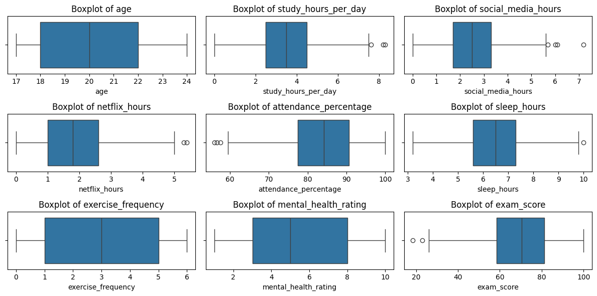

#### S/19/809

### Import Important Libraries


```python
import pandas as pd
import numpy as np
from sklearn.preprocessing import StandardScaler
from sklearn.decomposition import PCA
from sklearn.cluster import KMeans
from sklearn.metrics import silhouette_score
from sklearn.discriminant_analysis import LinearDiscriminantAnalysis
from sklearn.model_selection import train_test_split
from statsmodels.multivariate.manova import MANOVA
from scipy.stats import skew
import matplotlib.pyplot as plt
import seaborn as sns
```

### Exploratory Data Analysis


```python
# Load data
df = pd.read_csv("student_habits_performance.csv")
df = df.drop(columns=['student_id'])
```


```python
# Check for Null Values
df.isnull().sum()
```


    age                               0
    gender                            0
    study_hours_per_day               0
    social_media_hours                0
    netflix_hours                     0
    part_time_job                     0
    attendance_percentage             0
    sleep_hours                       0
    diet_quality                      0
    exercise_frequency                0
    parental_education_level         91
    internet_quality                  0
    mental_health_rating              0
    extracurricular_participation     0
    exam_score                        0
    dtype: int64


```python
# Drop Null Values
df.dropna(inplace=True)
```


```python
# numerical columns
cont_cols = ['age', 'study_hours_per_day', 'social_media_hours', 'netflix_hours',
             'attendance_percentage', 'sleep_hours', 'exercise_frequency',
             'mental_health_rating', 'exam_score']
```


```python
# Plot histograms of numerical variables
fig, axes = plt.subplots(nrows=3, ncols=3, figsize=(18, 12))
for ax, col in zip(axes.flatten(), cont_cols):
    sns.histplot(df[col], kde=True, ax=ax)
    ax.set_title(f'Histogram of {col}')
plt.tight_layout()
plt.show()
```


    

    


```python
# Correct skewness using log1p where necessary
for col in cont_cols:
    if skew(df[col]) > 1:
        df[col] = np.log1p(df[col])
    elif skew(df[col]) < -1:
        df[col] = np.log1p(df[col].max() + 1 - df[col])
```


```python
# Plot boxplots 
fig, axes = plt.subplots(nrows=3, ncols=3, figsize=(12, 6))
for ax, col in zip(axes.flatten(), cont_cols):
    sns.boxplot(x=df[col], ax=ax)
    ax.set_title(f'Boxplot of {col}')
plt.tight_layout()
plt.show()
```


    

    


```python
# Drop outliers using IQR method
Q1 = df[cont_cols].quantile(0.25)
Q3 = df[cont_cols].quantile(0.75)
IQR = Q3 - Q1
df = df[~((df[cont_cols] < (Q1 - 1.5 * IQR)) | (df[cont_cols] > (Q3 + 1.5 * IQR))).any(axis=1)]
```


```python
# Correlation heatmap
plt.figure(figsize=(12, 10))
corr_matrix = df[cont_cols].corr()
sns.heatmap(corr_matrix, annot=True, cmap='coolwarm', fmt='.2f', square=True)
plt.title('Correlation Heatmap of Continuous Variables')
plt.tight_layout()
plt.show()
```


    

    


```python
# Encode categorical variables
df_encoded = pd.get_dummies(df, drop_first=True)
```


```python
# Standardize continuous variables for PCA/Clustering
scaler = StandardScaler()
df_encoded[cont_cols] = scaler.fit_transform(df_encoded[cont_cols])
```

### Principal Component Analysis (PCA)


```python
# Scree Plot
pca_full = PCA()
pca_full.fit(df_encoded[cont_cols])
explained = pca_full.explained_variance_ratio_ * 100

plt.figure(figsize=(6, 4))
components = range(1, len(explained) + 1)

# Plot bars
plt.bar(components, explained, alpha=0.6, label='Explained Variance (Bar)')

# Plot line for explained variance
plt.plot(components, explained, marker='o', linestyle='-', color='r', label='Explained Variance (Line)')

plt.title('Scree Plot: Explained Variance by PCA Components')
plt.xlabel('Principal Component')
plt.ylabel('Explained Variance (%)')
plt.xticks(components)
plt.legend()
plt.grid(True)
plt.tight_layout()
plt.show()
```


    

    


```python
pca = PCA(n_components=4)
pca_components = pca.fit_transform(df_encoded[cont_cols])
pca_df = pd.DataFrame(pca_components, columns=['PC1', 'PC2', 'PC3', 'PC4'])

explained_variance_pct = pca.explained_variance_ratio_ * 100
total_variance = explained_variance_pct.sum()
print("\nTotal Explained Variance by First 4 Components: {:.1f}%".format(total_variance))

print("\nPCA Component Loadings:")
print(pd.DataFrame(pca.components_, columns=cont_cols, index=['PC1', 'PC2', 'PC3', 'PC4']))
```

    
    Total Explained Variance by First 4 Components: 56.8%
    
    PCA Component Loadings:
              age  study_hours_per_day  social_media_hours  netflix_hours  \
    PC1 -0.011974             0.619688           -0.130961      -0.141067   
    PC2  0.607187            -0.010277           -0.138231      -0.160850   
    PC3  0.143993             0.276097            0.553563      -0.004665   
    PC4 -0.294556            -0.281984            0.411437      -0.321082   
    
         attendance_percentage  sleep_hours  exercise_frequency  \
    PC1               0.082437     0.085022            0.102018   
    PC2              -0.168693     0.523888            0.316935   
    PC3               0.513896     0.079056           -0.414148   
    PC4               0.193727     0.563358            0.252679   
    
         mental_health_rating  exam_score  
    PC1              0.224676    0.709846  
    PC2             -0.427555    0.008366  
    PC3             -0.392693   -0.022737  
    PC4              0.377547    0.007512  
    

### Cluster Analysis (K-Means)


```python
# Determine optimal number of clusters using silhouette score
silhouette_scores = {}
for k in range(2, 7):
    km = KMeans(n_clusters=k, random_state=42)
    labels = km.fit_predict(df_encoded[cont_cols])
    score = silhouette_score(df_encoded[cont_cols], labels)
    silhouette_scores[k] = score

optimal_k = max(silhouette_scores, key=silhouette_scores.get)
print(f"Optimal number of clusters based on silhouette score: {optimal_k}")

# Fit KMeans with optimal clusters
kmeans = KMeans(n_clusters=optimal_k, random_state=42)
df_encoded['cluster'] = kmeans.fit_predict(df_encoded[cont_cols])

# Reduce to 2 components for visualization
pca_2d = PCA(n_components=2)
components_2d = pca_2d.fit_transform(df_encoded[cont_cols])

pca_cluster_df = pd.DataFrame(components_2d, columns=['PC1', 'PC2'])
pca_cluster_df['Cluster'] = df_encoded['cluster'].values

plt.figure(figsize=(4, 3))
sns.scatterplot(data=pca_cluster_df, x='PC1', y='PC2', hue='Cluster', palette='Set1', alpha=0.6)
plt.title('KMeans Clusters (PCA-Reduced to 2D)')
plt.xlabel('PC1')
plt.ylabel('PC2')
plt.legend(title='Cluster')
plt.grid(True)
plt.tight_layout()
plt.show()
```

    Optimal number of clusters based on silhouette score: 2
    


    

    


```python
# Compute mean values per cluster
group_summary = df_encoded.groupby('cluster')[['study_hours_per_day', 'social_media_hours', 'netflix_hours', 'attendance_percentage', 'sleep_hours', 'mental_health_rating', 'exam_score']].mean()
print(group_summary)
```

             study_hours_per_day  social_media_hours  netflix_hours  \
    cluster                                                           
    0                  -0.652950            0.167643       0.166875   
    1                   0.635654           -0.163203      -0.162454   
    
             attendance_percentage  sleep_hours  mental_health_rating  exam_score  
    cluster                                                                        
    0                    -0.088654    -0.169615             -0.332465   -0.808902  
    1                     0.086306     0.165122              0.323658    0.787474  
    

### Discriminant Analysis (LDA)


```python
# Discriminant Analysis 
df["score_cat"] = pd.cut(df["exam_score"], bins=[0, 60, 80, 100], labels=["Low", "Medium", "High"])
X = df_encoded.drop(columns=["exam_score", "cluster"])
y = df["score_cat"]
le = LabelEncoder()
y_encoded = le.fit_transform(y)
X_train, X_test, y_train, y_test = train_test_split(X, y_encoded, test_size=0.3, random_state=42)

lda = LinearDiscriminantAnalysis()
lda.fit(X_train, y_train)
y_pred = lda.predict(X_test)
print("\nDiscriminant Analysis Accuracy:", accuracy_score(y_test, y_pred))
print("\nClassification Report:")
print(classification_report(y_test, y_pred, target_names=le.classes_))

# Get loadings (coefficients) for each discriminant function
loadings = pd.DataFrame(lda.coef_.T, index=X_train.columns, columns=['LD1', 'LD2', 'LD3'])

# Display the full loading matrix
print("LDA Loadings (Coefficients for each Linear Discriminant Function):")
print(loadings)
```

    
    Discriminant Analysis Accuracy: 0.8847583643122676
    
    Classification Report:
                  precision    recall  f1-score   support
    
            High       0.93      0.85      0.89        81
             Low       0.91      0.91      0.91        78
          Medium       0.84      0.89      0.86       110
    
        accuracy                           0.88       269
       macro avg       0.89      0.88      0.89       269
    weighted avg       0.89      0.88      0.89       269
    
    LDA Loadings (Coefficients for each Linear Discriminant Function):
                                               LD1       LD2       LD3
    age                                  -0.020991  0.045847 -0.016250
    study_hours_per_day                   4.410360 -4.149786  0.040118
    social_media_hours                   -1.031841  0.932855  0.014012
    netflix_hours                        -0.677807  0.660533 -0.020179
    attendance_percentage                 0.532509 -0.444075 -0.030216
    sleep_hours                           0.790419 -0.700824 -0.019207
    exercise_frequency                    0.869817 -0.740774 -0.039874
    mental_health_rating                  1.773537 -1.616452 -0.016053
    gender_Male                           0.003735 -0.186899  0.112886
    gender_Other                         -0.446628 -0.348824  0.469208
    part_time_job_Yes                    -0.209882  0.047724  0.090250
    diet_quality_Good                     0.037756  0.094310 -0.079555
    diet_quality_Poor                    -0.083264  0.108836 -0.019521
    parental_education_level_High School  0.106120  0.017393 -0.071184
    parental_education_level_Master      -0.015131  0.023476 -0.005823
    internet_quality_Good                 0.042425  0.060831 -0.061614
    internet_quality_Poor                -0.198013  0.177537  0.003600
    extracurricular_participation_Yes     0.168949 -0.032994 -0.075985
    

### MANOVA


```python
manova_data = df[["exam_score", "mental_health_rating", "diet_quality",
                  "parental_education_level", "internet_quality", "part_time_job", "extracurricular_participation"]]
manova = MANOVA.from_formula(
    "exam_score + mental_health_rating ~ diet_quality + parental_education_level + internet_quality + part_time_job + extracurricular_participation",
    data=manova_data
)
print("\nMANOVA Results:")
print(manova.mv_test())
```

    
    MANOVA Results:
                         Multivariate linear model
    ====================================================================
                                                                        
    ---------------------------------------------------------------------
            Intercept         Value   Num DF   Den DF    F Value   Pr > F
    ---------------------------------------------------------------------
               Wilks' lambda  0.2418  2.0000  884.0000  1385.9390  0.0000
              Pillai's trace  0.7582  2.0000  884.0000  1385.9390  0.0000
      Hotelling-Lawley trace  3.1356  2.0000  884.0000  1385.9390  0.0000
         Roy's greatest root  3.1356  2.0000  884.0000  1385.9390  0.0000
    --------------------------------------------------------------------
                                                                        
    ---------------------------------------------------------------------
            diet_quality       Value   Num DF    Den DF   F Value  Pr > F
    ---------------------------------------------------------------------
                Wilks' lambda  0.9911  4.0000  1768.0000   1.9740  0.0960
               Pillai's trace  0.0089  4.0000  1770.0000   1.9738  0.0960
       Hotelling-Lawley trace  0.0089  4.0000  1059.7609   1.9756  0.0961
          Roy's greatest root  0.0078  2.0000   885.0000   3.4350  0.0327
    --------------------------------------------------------------------
                                                                        
    --------------------------------------------------------------------
         parental_education_level Value  Num DF   Den DF  F Value Pr > F
    --------------------------------------------------------------------
                    Wilks' lambda 0.9883 4.0000 1768.0000  2.6113 0.0339
                   Pillai's trace 0.0117 4.0000 1770.0000  2.6066 0.0342
           Hotelling-Lawley trace 0.0119 4.0000 1059.7609  2.6180 0.0338
              Roy's greatest root 0.0118 2.0000  885.0000  5.2412 0.0055
    --------------------------------------------------------------------
                                                                        
    ---------------------------------------------------------------------
          internet_quality     Value   Num DF    Den DF   F Value  Pr > F
    ---------------------------------------------------------------------
                Wilks' lambda  0.9963  4.0000  1768.0000   0.8285  0.5069
               Pillai's trace  0.0037  4.0000  1770.0000   0.8288  0.5067
       Hotelling-Lawley trace  0.0038  4.0000  1059.7609   0.8288  0.5068
          Roy's greatest root  0.0036  2.0000   885.0000   1.5768  0.2072
    --------------------------------------------------------------------
                                                                        
    ---------------------------------------------------------------------
            part_time_job       Value   Num DF   Den DF   F Value  Pr > F
    ---------------------------------------------------------------------
                 Wilks' lambda  0.9990  2.0000  884.0000   0.4314  0.6497
                Pillai's trace  0.0010  2.0000  884.0000   0.4314  0.6497
        Hotelling-Lawley trace  0.0010  2.0000  884.0000   0.4314  0.6497
           Roy's greatest root  0.0010  2.0000  884.0000   0.4314  0.6497
    --------------------------------------------------------------------
                                                                        
    --------------------------------------------------------------------
     extracurricular_participation Value  Num DF  Den DF  F Value Pr > F
    --------------------------------------------------------------------
                     Wilks' lambda 0.9998 2.0000 884.0000  0.0771 0.9258
                    Pillai's trace 0.0002 2.0000 884.0000  0.0771 0.9258
            Hotelling-Lawley trace 0.0002 2.0000 884.0000  0.0771 0.9258
               Roy's greatest root 0.0002 2.0000 884.0000  0.0771 0.9258
    ====================================================================
    
    
